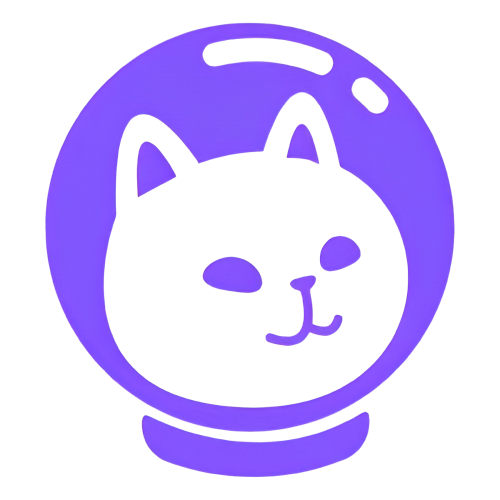
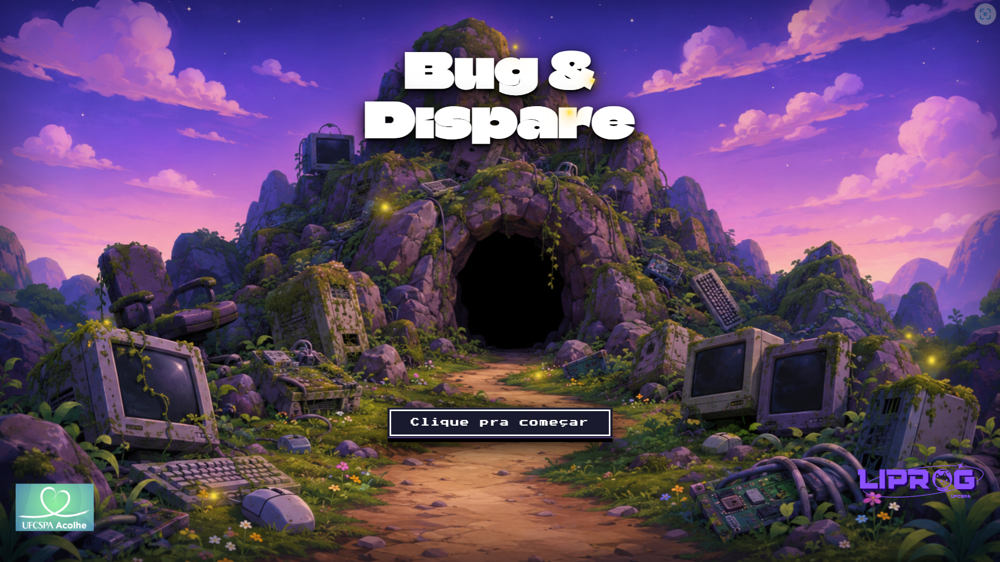
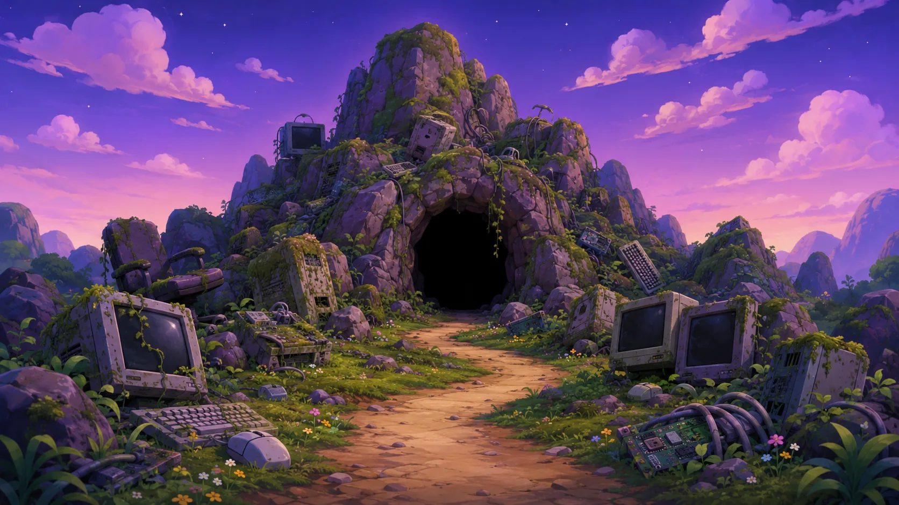
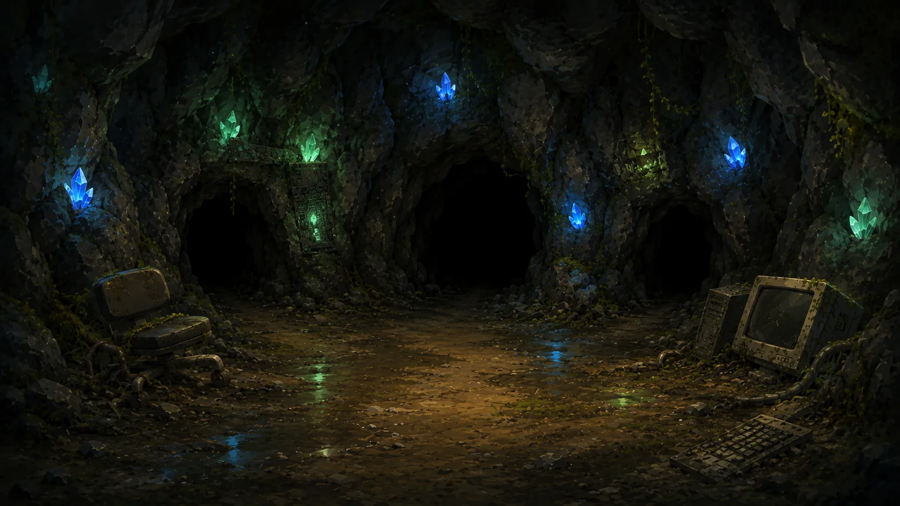
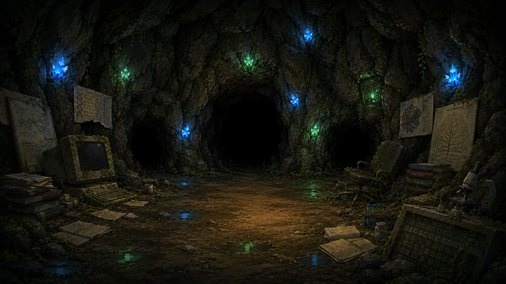
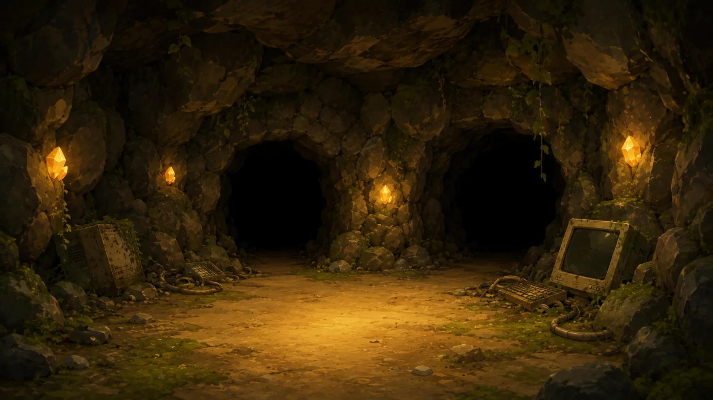
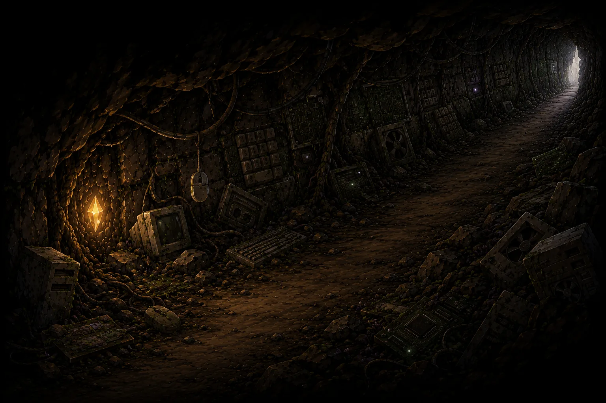
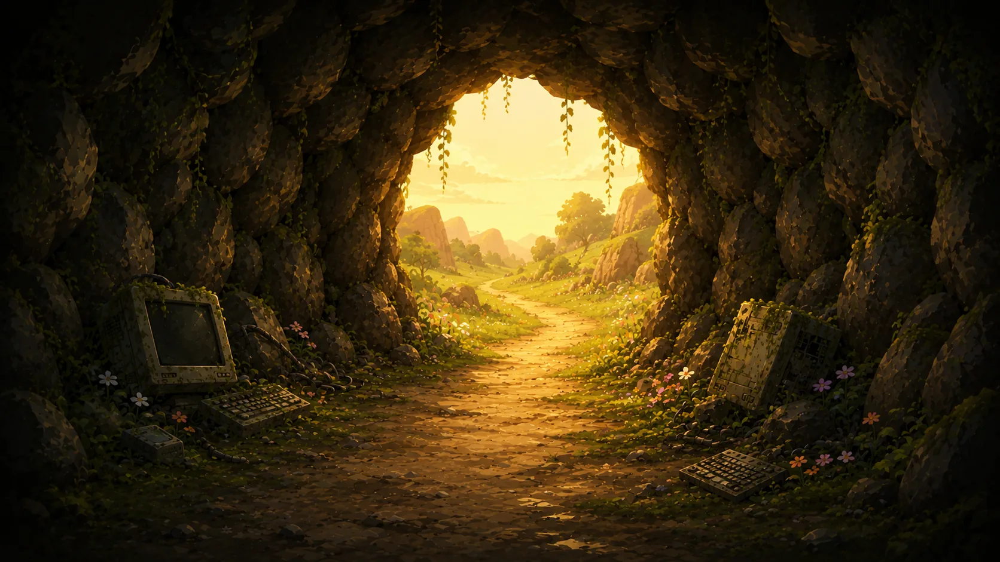
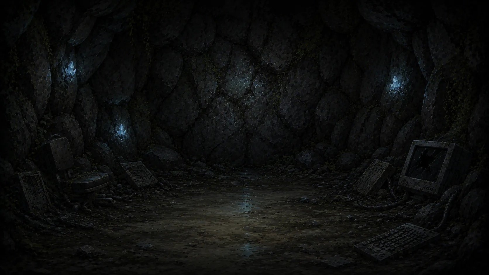
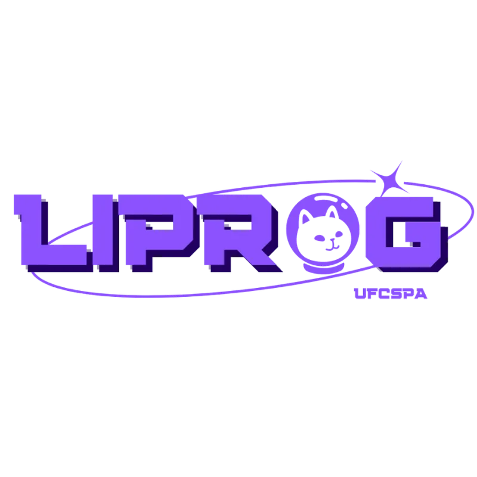

# Bug & Dispare

<div align="center">
  
  <br/><br/>
  
  <br/><br/>

[](https://react.dev)
[](https://vite.dev)
[](https://github.com/features/actions)
</div>

---

## Sobre o projeto

O **Bug & Dispare** é um jogo de quiz com temática RPG sobre lógica de programação, desenvolvido pela **LIPROG** — Liga Acadêmica de Programação e Tecnologia em Saúde da UFCSPA. O jogo é a atividade que a liga apresenta no **UFCSPA Acolhe**, feira aberta da universidade que divulga à comunidade externa — em especial estudantes do ensino médio — os cursos, projetos de pesquisa, extensão e ligas acadêmicas da UFCSPA.

A dinâmica surgiu na primeira edição do **UFCSPA Acolhe 2025** de forma analógica: membros da LIPROG abordavam os visitantes e faziam perguntas de lógica de programação. Quem acertasse ganhava o direito de atirar num alvo de dardo para conquistar um prêmio.

Para a edição de **2026** surgiu a ideia de digitalizar essa experiência. O jogo preserva a mecânica original — perguntas com dificuldade progressiva e recompensa ao final — e adiciona uma camada de narrativa com estética de RPG clássico.

---

## Inspirações

O jogo tomou como referência **The Legend of Zelda: Ocarina of Time** e **Pokémon HeartGold**: a ambientação de caverna com caminhos ramificados vem de Zelda, e a transição de tela com flash branco seguido de expansão circular em preto é baseada na clássica transição de batalha de Pokémon, recriada no componente `TransitionOverlay.jsx`.

---

## Cenários

Todos os cenários são imagens geradas pelo **DALL-E (OpenAI)** com prompts orientados à estética dos jogos de referência. Cada cena corresponde a um estado diferente do jogo dentro de uma caverna com caminhos a explorar. As imagens são exportadas em `.webp` e pré-carregadas antes do início da partida.

<div align="center">

| Cena | Descrição |
|------|-----------|
|  | **Entrada** — Tela inicial, boca da caverna |
|  | **Fase 1** — Três caminhos, perguntas fáceis e médias |
|  | **Fase 2** — Progressão completa: fácil, médio e difícil |
|  | **Fase 3** — Dois caminhos, perguntas médias e difíceis |
|  | **Pergunta** — Fundo exibido durante as questões |
|  | **Vitória** — Exibida ao concluir as três fases |
|  | **Game Over** — Exibida ao errar uma questão |

</div>

---

## Efeitos visuais

Para dar movimento às imagens estáticas, dois efeitos CSS são aplicados em todas as telas.

### Ken Burns
Zoom lento combinado com deslocamento sutil implementado via `@keyframes` com `transform: scale()` e `translate()`, ao longo de 24–28 segundos. Uma animação de vinheta (`vignette breathing`) pulsa levemente nas bordas, complementando o efeito.

### Fireflies
Vagalumes flutuantes implementados em `Fireflies.jsx` a partir de uma técnica do GeeksforGeeks: três animações CSS independentes (`ff-x`, `ff-y`, `ff-glow`) são aplicadas simultaneamente em cada partícula com durações e delays distintos. Como as animações não têm relação de fase entre si, a trajetória resultante de cada vagalume é orgânica sem necessidade de keyframes individuais por elemento.

**Referências:**

- Ken Burns effect — [Kirupa.com — The Ken Burns Effect Using CSS Animations](https://www.kirupa.com/html5/ken_burns_effect_css.htm)
- Fireflies animation — [GeeksforGeeks — Create a CSS Fireflies background using HTML/CSS](https://www.geeksforgeeks.org/css/create-a-css-fireflies-background-using-html-css/)

---

## Arquitetura

O jogo é construído em **React 19 + Vite** como uma SPA sem roteamento. Toda a navegação é gerenciada por uma máquina de estados em `App.jsx`.

### Fluxo de estados

```
INTRO
  └─▶ SCENE (fase 0, 1 ou 2)
        └─▶ QUESTION
              ├─▶ CORRECT (1.8s) ──▶ SCENE (próxima fase) ou VICTORY
              └─▶ WRONG_REVEAL (2.5s) ──▶ GAMEOVER
```

### Progressão de dificuldade

Definida em `session.js` e embaralhada a cada sessão:

```
Fase 1: fácil × 2 + médio
Fase 2: fácil + médio + difícil
Fase 3: médio + difícil
```

As questões de cada dificuldade são embaralhadas no início da sessão e cada uma é sorteada no máximo uma vez por partida.

### Caminhos interativos

`SceneScreen.jsx` sobrepõe áreas de clique circulares em SVG sobre a imagem de fundo. Coordenadas e raios são definidos em `src/data/scenes.json`, separando configuração de layout do código do componente. Ao passar o mouse ou focar pelo teclado, um gradiente radial em SVG realça o caminho selecionado.

### Áudio

Gerenciado pelo **Howler.js** (`src/utils/sound.js`). A música de fundo sofre *ducking* (volume reduzido temporariamente) enquanto efeitos sonoros de acerto são reproduzidos. O `AudioContext` é desbloqueado no primeiro `mousedown` ou `touchstart` para contornar restrições de autoplay dos navegadores.

---

## Questões via Google Sheets

As perguntas são carregadas a partir de uma planilha pública do Google Sheets exportada como CSV, permitindo que o banco de questões seja atualizado sem alterações no código.

### Formato da planilha

| difficulty | text | code | option1 | option2 | option3 | option4 | correctIndex |
|---|---|---|---|---|---|---|---|
| `easy` / `medium` / `hard` | Enunciado | Trecho de código (opcional) | Opção A | Opção B | Opção C | Opção D | `0`–`3` |

### Configuração

1. Crie a planilha com as colunas acima
2. Publique como CSV: `Arquivo → Compartilhar → Publicar na web → CSV`
3. Cole a URL no `.env`:

   ```env
   VITE_SHEETS_URL=https://docs.google.com/spreadsheets/d/e/.../output=csv
   ```

4. Para produção, adicione `VITE_SHEETS_URL` como secret no repositório GitHub

### Parser e fallback

`fetchQuestions.js` implementa um parser RFC 4180 sem dependências externas, com suporte a campos entre aspas contendo quebras de linha — necessário para questões com blocos de código multilinha. O fetch tem timeout de 6 segundos. Em caso de falha ou URL ausente, o jogo utiliza `src/data/questions.json` como fallback local.

---

## Tech stack

| Tecnologia | Uso |
|---|---|
| [React 19](https://react.dev) | UI e gerenciamento de estado |
| [Vite](https://vitejs.dev) | Build e dev server |
| [Howler.js](https://howlerjs.com) | Áudio cross-browser (Web Audio API) |
| [DALL-E (OpenAI)](https://openai.com/dall-e) | Geração dos cenários |
| Google Sheets (CSV) | Banco de questões |
| GitHub Actions | Deploy no GitHub Pages |

---

## Rodando localmente

```bash
git clone https://github.com/liprog/liprog-game.git
cd liprog-game
npm install
cp .env.example .env
npm run dev
```

O jogo funciona sem `.env` configurado, usando as questões do fallback local.

---

## Deploy

Automático via GitHub Actions ao fazer push na branch `main`. Publicado no GitHub Pages com base path `/liprog-game/`.

---

<div align="center">
  <sub><strong>LIPROG — Liga Acadêmica de Programação e Tecnologia em Saúde</strong> · UFCSPA Acolhe 2026</sub>
  <br/><br/>
  
  &nbsp;&nbsp;
  
</div>
